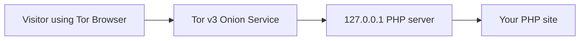

# HostOnion

### Host PHP sites privately over Tor — from one command.

<div align="center">

   

**Loopback PHP server** &nbsp;•&nbsp; **Tor hidden service** &nbsp;•&nbsp; **Security-conscious runtime**

</div>

---

## What is HostOnion?

HostOnion turns a PHP website into a Tor v3 onion service without exposing the PHP server directly to the public network. PHP stays bound to `127.0.0.1`; Tor publishes the onion endpoint.

It is designed for personal hosting, private demos, labs, and privacy-focused experiments. For production workloads, review the application and use a hardened PHP-FPM plus nginx/Caddy deployment where appropriate.

## Demo

The included demo site is a tiny PHP application with a homepage and a health endpoint. It was tested successfully with PHP 8.3:

<div align="center">


<sub>Demo output: PHP is running successfully behind the HostOnion launcher.</sub>

</div>

### Run the demo

```bash
sudo apt update
sudo apt install -y python3 php-cli tor

chmod 700 hostonion.py
./hostonion.py demo_site --verbose
```

The launcher prints the generated onion address when Tor finishes bootstrapping. To test the included endpoint locally:

```bash
php -S 127.0.0.1:8080 -t demo_site
curl http://127.0.0.1:8080/health.php
# OK
```

## Why HostOnion?

| Capability | Included |
| --- | :---: |
| Tor v3 onion service generation | Yes |
| PHP loopback binding | Yes |
| Single-site and multi-site hosting | Yes |
| Automatic PHP restart with backoff | Yes |
| Local HTTP health check | Yes |
| Tor bootstrap timeout handling | Yes |
| Site-name and port validation | Yes |
| Single-instance file lock | Yes |
| Private runtime permission hardening | Yes |
| Onion identity backup and restore | Yes |
| Status and verbose logging | Yes |

## How it works



The public-facing path is:

```text
Tor Browser → .onion address → Tor → 127.0.0.1:local-port → PHP site
```

## Quick start

### 1. Install dependencies

```bash
sudo apt update
sudo apt install -y python3 php-cli tor
```

HostOnion requires Python 3.9+, PHP CLI, and Tor 0.4.6 or newer. `pyperclip` is optional and is only needed for `--copy`.

### 2. Host a site

```bash
chmod 700 hostonion.py
./hostonion.py /path/to/your/site --verbose
```

When Tor is ready, you will see output similar to:

```text
[+] default      → http://xxxxxxxxxxxxxxxxxxxxxxxxxxxxxxxxxxxxxxxxxxxxxxxx.onion
[+] PHP auto-restart: enabled (max 5/60s)
```

Press `Ctrl+C` to stop PHP and Tor cleanly.

### 3. Host multiple sites

```bash
./hostonion.py \
  --site blog=/srv/www/blog \
  --site shop=/srv/www/shop \
  --verbose
```

Each site receives its own local port and onion identity. Site names may contain 1–64 ASCII letters, numbers, `_`, and `-` characters.

## Configuration

Create `hostonion.toml` next to `hostonion.py` when you want persistent settings:

```toml
verbose = true
copy = false

[sites.blog]
path = "/srv/www/blog"
port = 9000

[sites.shop]
path = "/srv/www/shop"
port = 9001
```

## Useful commands

```bash
# Generate new onion identities for all configured sites
./hostonion.py /path/to/site --new

# Reset one site's onion identity
./hostonion.py --site blog=/srv/www/blog --new-site blog

# Restore the saved hidden-service backup
./hostonion.py --restore

# Show the current PID and known onion hostnames
./hostonion.py --status

# Copy onion URLs when pyperclip is available
./hostonion.py /path/to/site --copy

# Disable PHP auto-restart
./hostonion.py /path/to/site --no-restart
```

## Runtime layout

The launcher stores runtime data beside the script in `tor/`:

```text
tor/
├── torrc
├── tor.log
├── hostonion.log
├── php_<site>.log
├── hidden_service/
└── hidden_service_backup/
```

The hidden-service directory contains private keys. Never commit or share it. Runtime files, hostnames, keys, logs, and PID files are excluded by `.gitignore` where applicable.

## Security notes

- Keep onion private keys in a protected directory and use secure backups.
- Do not place `.env` files, credentials, database dumps, logs, or source-control metadata inside a public site directory.
- The PHP built-in server is intended for personal/demo use; use PHP-FPM plus a carefully configured web server for production.
- Tor does not fix application vulnerabilities. Audit authentication, uploads, sessions, CSRF, XSS, SQL injection, dependencies, and outbound requests.
- Anyone who knows an onion address can connect unless the application or Tor client authorization restricts access.
- Keep the OS, PHP, Tor, and application dependencies patched.

## Project structure

```text
hostOnion/
├── hostonion.py        # Main launcher
├── demo_site/           # Minimal PHP demo
├── assets/              # Project artwork and demo screenshot
├── install.sh           # Ubuntu/Debian deployment helper
├── termux/              # Termux setup helper
├── WINDOWS.md           # Windows Server guide
└── LICENSE              # MIT License
```

## Contributing

Issues and pull requests are welcome. Please avoid committing private keys, onion hostnames, logs, credentials, or generated runtime state.

## License

HostOnion is released under the **MIT License**. See [`LICENSE`](LICENSE) for the full text.

<div align="center">

Made for privacy-focused hosting experiments.

</div>
